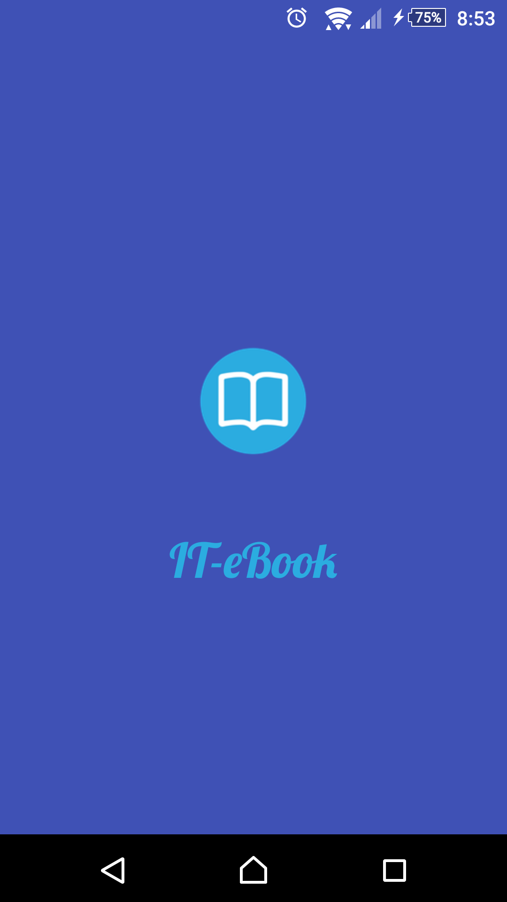
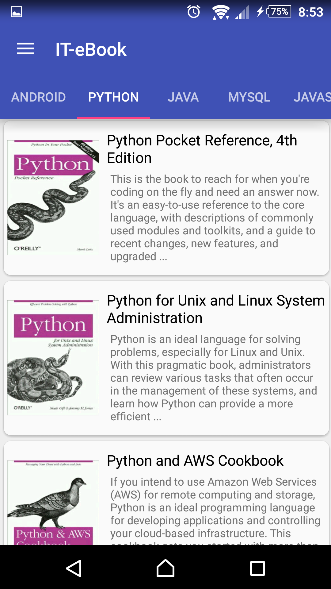
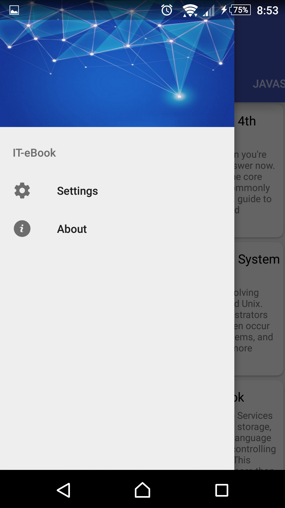
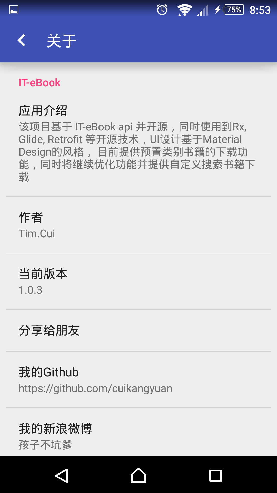
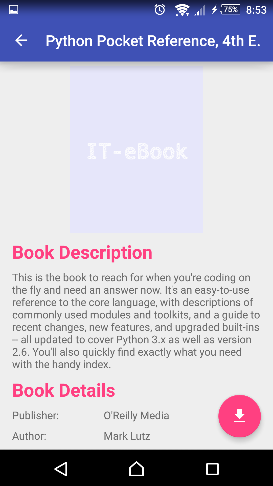
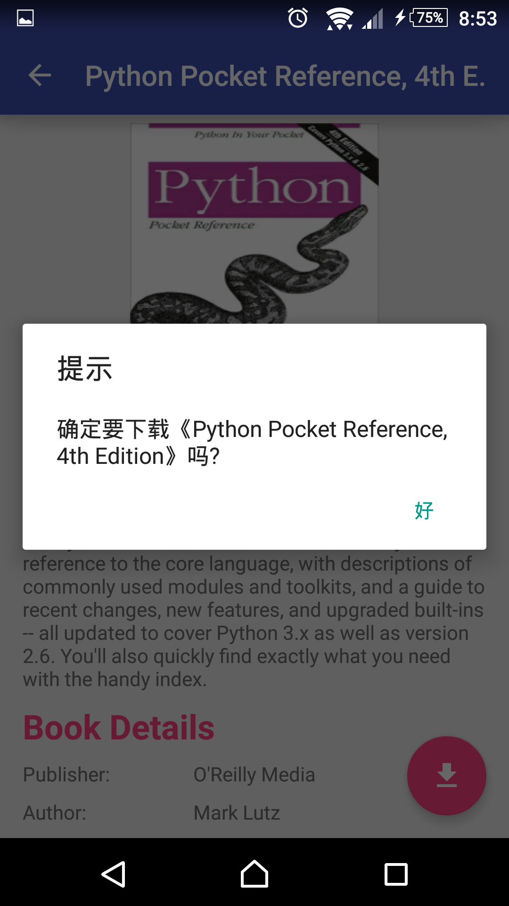

# IT-eBook App

------

该项目基于 IT-eBook api 并开源，同时使用到Rx, Glide, Retrofit 等开源技术，UI设计基于Material Design的风格， 目前提供预置类别书籍的下载功能，同时将继续优化功能并提供自定义搜索书籍下载

应用截图 

[Apk下载](http://fir.im/41ud)

致谢 
[JakeWharton](https://github.com/JakeWharton) 
[扔物线](https://github.com/rengwuxian) 
[xcc3641](https://github.com/xcc3641) 
[lsxiao](https://github.com/lsxiao) 
[IT-eBooks-API.info](http://it-ebooks-api.info/) 

